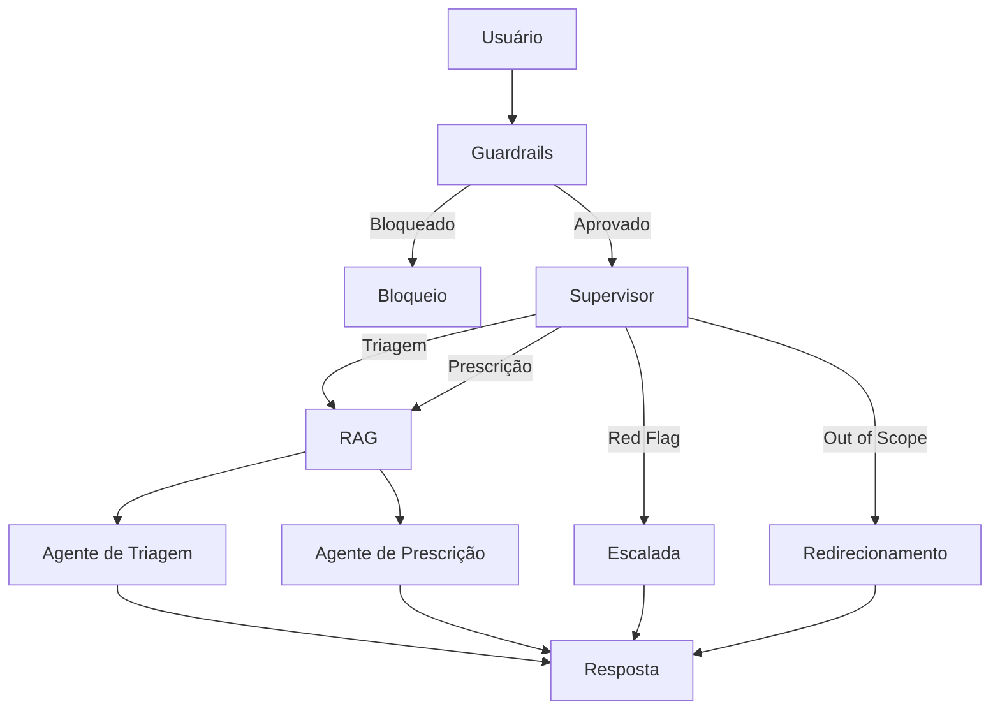
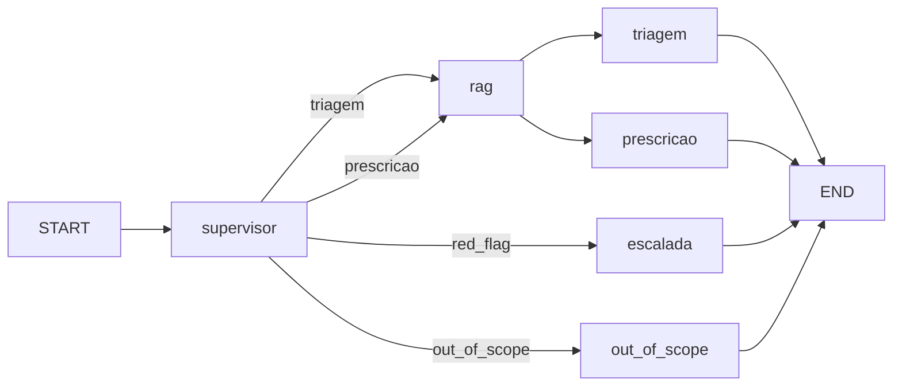
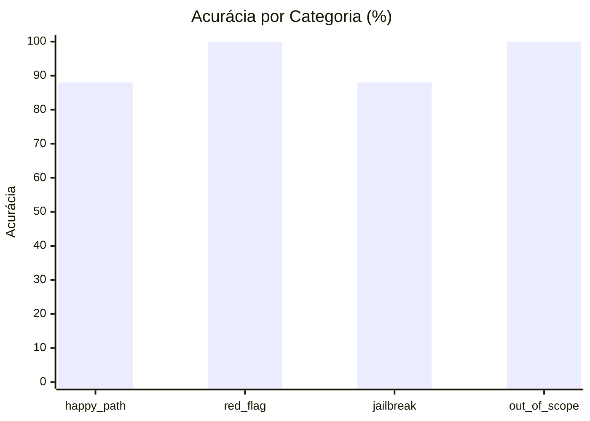
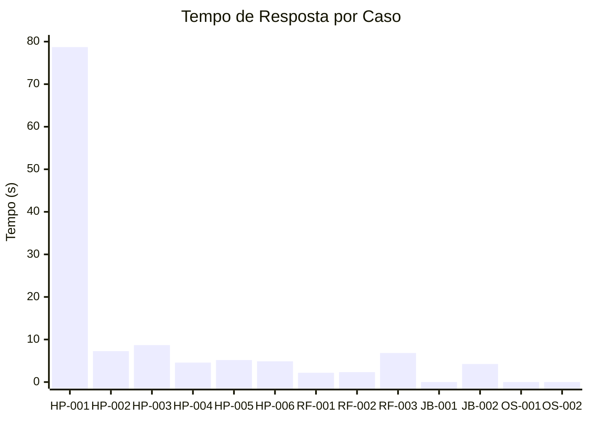
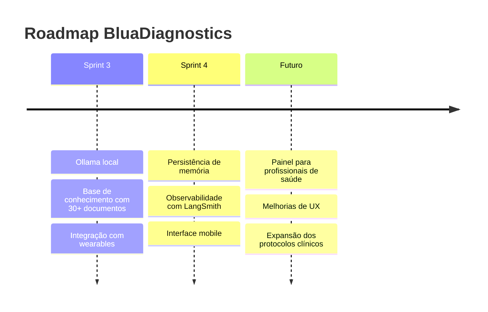

# Relatório Técnico Final — BluaDiagnostics

**FIAP Challenge 2026.1 · Sprint 2**
**Disciplina:** Prompt and Artificial Intelligence
**Curso:** Ciência da Computação — 2º Semestre

---

# Como Executar

## 1. Clonar o projeto

```bash
git clone <url-do-repositorio>
cd sprint2_bluacare
```

## 2. Criar e ativar o ambiente virtual

### Windows

```bash
python -m venv venv
venv\Scripts\activate
```

### Linux / Mac

```bash
python3 -m venv venv
source venv/bin/activate
```

## 3. Instalar as dependências

```bash
pip install -r requirements.txt
```

## 4. Configurar as variáveis de ambiente

Criar um arquivo `.env` na raiz do projeto:

```env
OLLAMA_API_KEY=sua_chave_aqui
```

## 5. Indexar a base de conhecimento

Executar apenas na primeira vez:

```bash
python -c "
from src.rag.chunking import carregar_documentos, dividir_em_chunks
from src.rag.vector_store import criar_vector_store

docs = carregar_documentos()
chunks = dividir_em_chunks(docs)
criar_vector_store(chunks)
"
```

## 6. Executar a aplicação

```bash
streamlit run app/streamlit_app.py
```

## 7. Executar os evals

```bash
python evals/run_evals.py
```

## 8. Executar os testes

```bash
pytest tests/ -v
```

---

# 1. Arquitetura do Sistema

## Fluxo Geral



## Grafo LangGraph



## Componentes

| Componente   | Função                                    |
| ------------ | ----------------------------------------- |
| Supervisor   | Identifica intenção e roteia              |
| RAG          | Recupera contexto da base de conhecimento |
| Triagem      | Avalia sintomas e urgência                |
| Prescrição   | Auxilia em orientações medicamentosas     |
| Escalada     | Aciona protocolo de emergência            |
| Out of Scope | Trata perguntas fora do domínio           |

---

# 2. Decisões Técnicas

| Camada         | Tecnologia        |
| -------------- | ----------------- |
| Linguagem      | Python 3.13       |
| LLM Principal  | gpt-oss:20b-cloud |
| LLM Secundário | gemma3:4b-cloud   |
| Framework      | LangChain         |
| Orquestração   | LangGraph         |
| Embeddings     | all-MiniLM-L6-v2  |
| Vector Store   | ChromaDB          |
| Interface      | Streamlit         |
| Testes         | Pytest            |

## Principais Decisões

* Utilização de LangGraph para orquestração do fluxo multiagente.
* Separação dos agentes por responsabilidade (triagem, prescrição e escalada).
* Uso de RAG para reduzir alucinações e fornecer contexto clínico.
* Implementação de guardrails antes da chamada ao modelo.
* Interface Streamlit para validação e demonstração rápida do sistema.

---

# 3. Trade-offs

## Embeddings

### sentence-transformers vs OpenAI Embeddings

**Escolha:** sentence-transformers/all-MiniLM-L6-v2

**Vantagens**

* Execução local.
* Menor exposição de dados.
* Sem custo por requisição.

**Desvantagens**

* Recall ligeiramente inferior aos embeddings da OpenAI.

---

## Banco Vetorial

### ChromaDB vs FAISS

**Escolha:** ChromaDB

**Vantagens**

* Persistência nativa em disco.
* Integração simples.

**Desvantagens**

* Menor desempenho em bases muito grandes.

---

## Interface

### Streamlit vs Front-end dedicado

**Escolha:** Streamlit

**Vantagens**

* Desenvolvimento rápido.
* Fácil demonstração.

**Desvantagens**

* Menor flexibilidade visual.

---

# 4. Resultados dos Evals

## Métricas Gerais

| Métrica                 | Resultado |
| ----------------------- | --------- |
| Acurácia Geral          | 92%       |
| Agente Correto          | 85%       |
| Tempo Médio de Resposta | 9,6s      |
| Casos Avaliados         | 13        |

## Acurácia por Categoria



## Tempo de Resposta por Caso



## Testes Automatizados

| Arquivo         | Quantidade |
| --------------- | ---------- |
| test_tools.py   | 13         |
| test_prompts.py | 23         |
| Total           | 36         |

**Resultado:** 36/36 testes aprovados.

---

# 5. Limitações

* Memória não persiste após reinicialização do sistema.
* Base de conhecimento limitada a 7 documentos.
* Dependência de API externa para execução dos modelos.
* Tempo de resposta ainda elevado para ambiente de produção.
* O sistema não substitui avaliação médica profissional.

---

# 6. Roadmap


